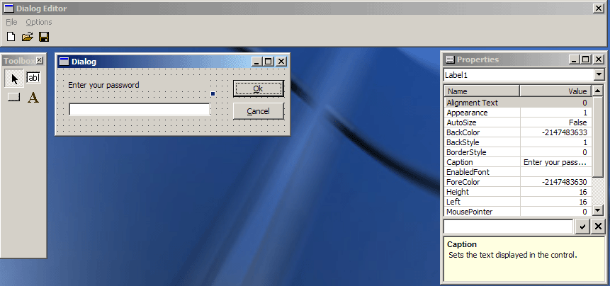



## Dialog Editor

### Description

This is the base template for a dialog editor for anyone to use. You can create basic controls (not all implemented yet), edit their properties, move them, and resize them.
 
### More Info
 

             |
---                |---
**Submitted On**   |2001-09-11 22:26:30
**By**             |[vcv](https://github.com/Planet-Source-Code/PSCIndex/blob/master/ByAuthor/vcv.md)
**Level**          |Advanced
**User Rating**    |4.8 (95 globes from 20 users)
**Compatibility**  |VB 5\.0, VB 6\.0
**Category**       |[Complete Applications](https://github.com/Planet-Source-Code/PSCIndex/blob/master/ByCategory/complete-applications__1-27.md)
**World**          |[Visual Basic](https://github.com/Planet-Source-Code/PSCIndex/blob/master/ByWorld/visual-basic.md)
**Archive File**   |[Dialog Edi2881810132001\.zip](https://github.com/Planet-Source-Code/vcv-dialog-editor__1-28044/archive/master.zip)

